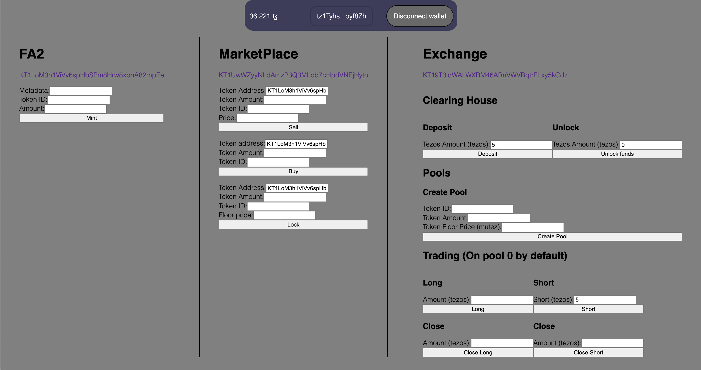

# NFT Perps - Tezos

## Projet description

Tentative of building a perpetual market for NFT floor prices on Tezos blockchain.
Please take a look at the whitepaper.

All contracts are live on granadanet - please look at their specifics READMEs to know more.
You should be able to run the frontend and oracle locally - but they are mostly for demo. 

Inspired from: https://www.paradigm.xyz/2021/08/floor-perps/

## How to

### Contracts

You can find all the contracts in `./contract/`. There are the mligo and michelson code and some scripts you can use to compile and deploy the contracts (you'll need docker and tezos-client correctly set-up - please look at https://assets.tqtezos.com/docs/setup/1-tezos-client/ and `./contract/setup_tezos_client.sh`).
It's also recommended that you change the default storage values in the `compile_storage.sh` scripts, especially the default admin addresses.

### Oracle Backend

Backend of the oracle - it consists of a oclif script which fetches an asset price on the NFT marketplace and send it to an entrypoint of the exchange contract. The exchange would then update the floorprice of the assets and perform the funding mechanism of the perpetual swap (regular payment paid from longs to shorts or from shorts to longs depending on the difference between the market price and the floor price).
This step should be automatize and performed by nodes in order to be: 1) decentralized, 2) robust. Rewards should be paid to the users running the oracle nodes.

### Frontend

Currently a frontend mostly made to facilitates the interactions with the smart contracts. Please look into `./dummy_fronted` to see how to use it.

## TODO

In order to be complete, there is still a large amount of work to be done in this project.

1. Rather than building a specific NFT marketplace from scratch, it would be better to work on collaboration with popular NFT marketplaces which are already widely used. So that we could simply focus on working on a contract allowing users to lock their NFT against a token reflecting the floor price of their NFT collection and propose it as an additionnal functionnality to existing marketplaces. That would allow us to focus on the exchange part which is already challenging and give use already a potentially large user base.

2. Exchange issues:
There are still lots of bugs/flaws in the way the exchange is designed, and some critical points whould be addressed.
- Prevent users from withdrawing their cash from the clearing house if they wouldn't be able to cover their opened position.
- The funding process seems to be working improperly (wrong values) - need to be fixed.
- Have a proper way to handle margin calls and large price fluctuations. In the current implementation, the risk is not well managed and the mechanism to deal with liquidation has not be considered.
- In regards of the liquidation process, we should also create an insurance fund in order to deal with large price fluctuations that could prevent the funding mechanism to operate properly. A part of the trading fees would automatically be used to finance this fund.

3. Decentralized governance:
We should give the users to choice to vote on things such as: Fees rate and spread rate on a pool.
They should also be able to propose new ideas that could be used to improve the platform.

5. Tokenomics:
There should be a utility token designed to faciliate and make incentives for users to take part of the decentralized governance of the protocol.
Holders of the tokens would have voting rights proportional to their holdings. Also, it could be used to pay users who run the oracle nodes.

There are still certainly some other considerations to take into accounts for the project to be viable.
